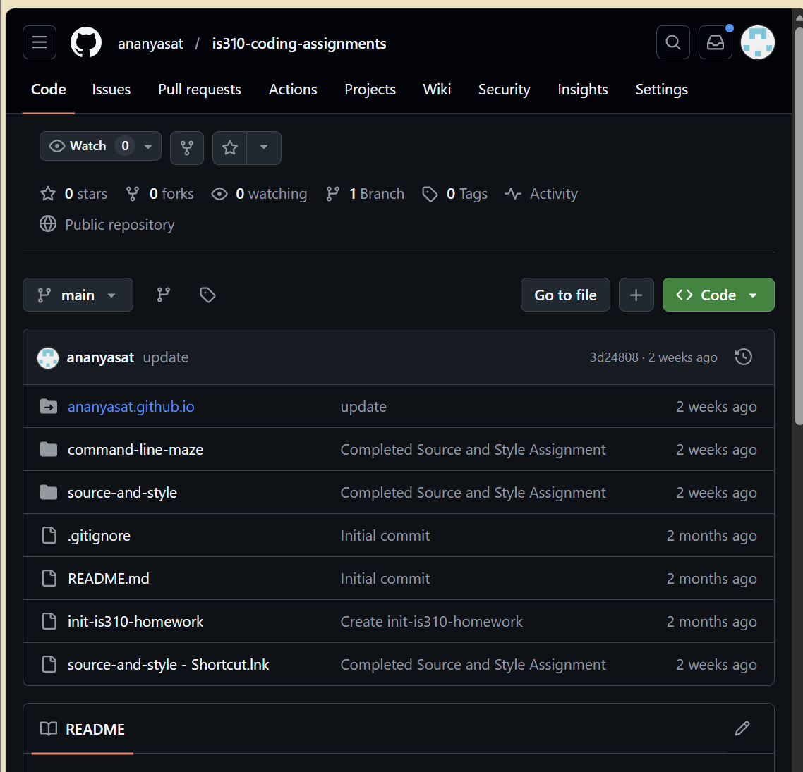
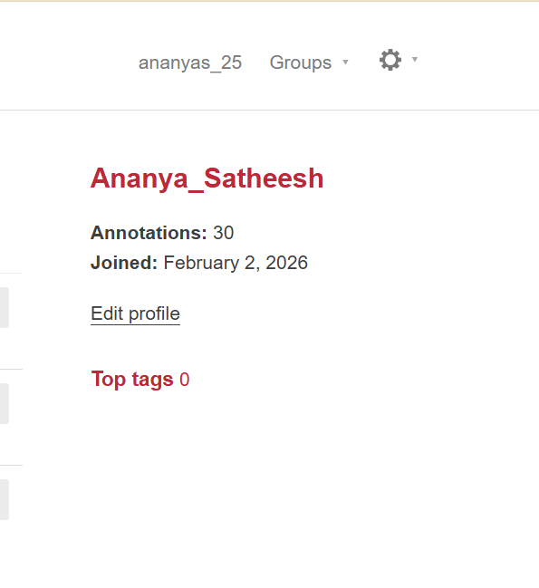
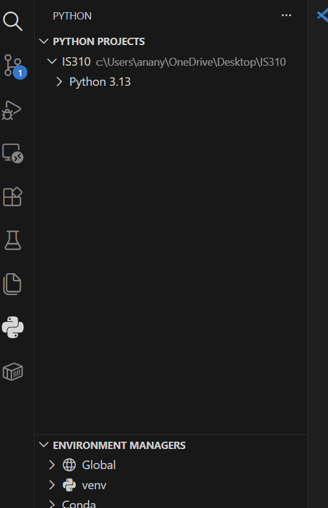
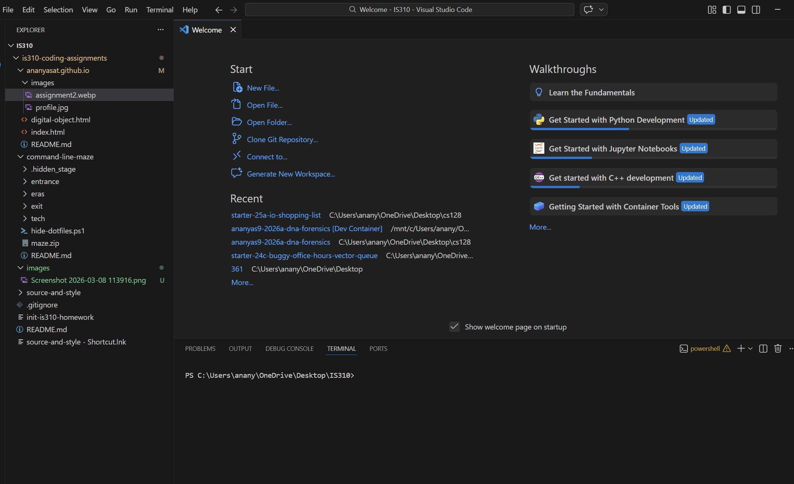

# Init IS310 Homework

## Proof of Installation

Proof of VS Code, Hypothesis, Python and Git on Images folder

4. AI Tool/Workflow 

How will you work with AI? What tools if any do you plan to use?

Plan to use it for code debugging in coding projects

Hypothesis  UserName: 

ananyas_25